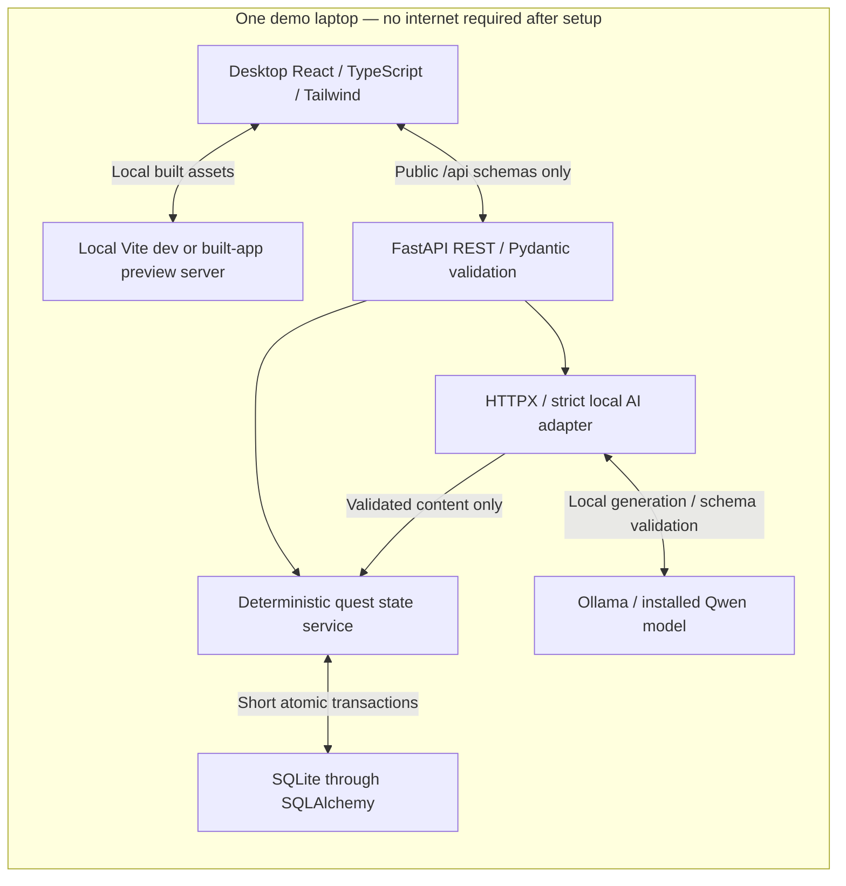

# Local AI Quest Companion architecture

Phase 0 blueprint, P0 only. Source: [final PRD v2.0](Local_AI_Quest_Companion_Final_PRD.docx),
sections 1–19, and the locked implementation decisions in the task. Proposed
product behavior below is not implemented yet. Phase 1A has retired the legacy
PWA and aligned Vite's host with localhost; the generic status/prompt page and
backend diagnostics remain. [DECISIONS](DECISIONS.md) records conflicts;
[P0_IMPLEMENTATION_PLAN](P0_IMPLEMENTATION_PLAN.md) sets acceptance gates.
Phase 1B adds internal strict initial proposals and a developer benchmark;
[AI_BENCHMARK](AI_BENCHMARK.md) records partial semantic feasibility, not product readiness.
Phase 2 adds persistent deterministic state and state-only APIs. Check-in/live
generation/adaptive AI orchestration and frontend product screens remain future.
The Phase 2 implementation sections in [DATABASE_DESIGN](DATABASE_DESIGN.md)
and [API_CONTRACT](API_CONTRACT.md) take precedence over the original proposed
file/schema descriptions below.

Phase 3 adds persistent check-ins, deterministic one-question clarification,
local generation/replan orchestration, durable intent leases and the explicit
v1 → v2 migration. All eight tables run locally; no frontend screens are added.
AI feasibility remains PARTIAL. Current rollout/schema details are in the Phase 3
sections of API_CONTRACT/DATABASE_DESIGN, superseding the historical Phase 2 inventory.
The same Ollama client performs generation plus one compact structured review;
known quality violations and uncertain reviews reject before mutation.

## System overview

The browser never calls Ollama or SQLite directly. A model generates language and
planning content; deterministic Python owns completion, XP, unlocking, dates and
validation. No remote inference, cloud DB, mandatory authentication, service
worker, mobile packaging or game-world engine belongs to P0.

## Repository audit and reusable infrastructure

| Existing file/area | Reuse | Gap or risk |
| --- | --- | --- |
| [frontend/package.json](../frontend/package.json) | React 19.3, TypeScript 7, Vite 8.3, Tailwind 4.3, Router 8.4; strict type/build scripts and lockfile | PWA plugin removed in Phase 1A; no product screens or automated UI runner. Exact locked versions remain authoritative. |
| [frontend/src](../frontend/src/) | Pages/components/hooks/API helper locations; typed loading/errors; cancellation | Current page is generic prompt generation, not quests; no persisted selection/progress. |
| [vite.config.ts](../frontend/vite.config.ts) | Local asset build; localhost:5173 dev and localhost:4173 preview, strict ports | No generated manifest/worker. Browsers with a previous PWA installation require scoped cleanup. |
| [main.py](../backend/app/main.py), [routes.py](../backend/app/routes.py), [quest_routes.py](../backend/app/quest_routes.py) | Lifecycle/bootstrap, explicit CORS/Idempotency-Key, diagnostics and state routes | Health checks storage; combined AI readiness and AI product routes remain future. |
| [config.py](../backend/app/config.py) | Pydantic Settings and dotenv examples | URL type permits remote hosts; local-only is currently a rule, not enforced. Relative DB path depends on working directory. |
| [database.py](../backend/app/database.py), [models.py](../backend/app/models.py), [schema.py](../backend/app/schema.py), [quests.py](../backend/app/services/quests.py) | Six state tables, FK/WAL/explicit transactions, guarded bootstrap, deterministic progression | No CheckIn/AI receipt leases or migration to future tables yet. |
| [ollama.py](../backend/app/ollama.py), [schemas.py](../backend/app/schemas.py) | Tags/plain-text diagnostics plus internal strict initial proposals, bounded retry and capacity validation in Phase 1B | No production quest orchestration/persistence; semantic quality remains partial. |
| [test_smoke.py](../backend/tests/test_smoke.py) | unittest/HTTPX mocking, lifecycle/schema/CORS checks | Not proof of real model performance, disk persistence, concurrent XP safety or product behavior. |
| Existing governance/disclosure docs | Setup, style/review practices, license placeholders and QA discipline | Generic-product/PWA wording must be reconciled with this desktop product. |

Diagnostic routes are `GET /api/health` (database readiness), `GET /api/ai/status`
(tags/model availability), `POST /api/ai/generate` (`{prompt}` → `{model,response}`).
Generic diagnostic errors use `detail`; state routes use a typed `error`
envelope. `/docs`, `/redoc`, `/openapi.json` are framework utilities. Optional
interactive docs reference external UI assets; core application use must not rely
on them. No working source/configuration is changed in Phase 0.

Health now checks DB availability without contacting Ollama. State routes add saved list/detail/profile,
complete and pause/resume. These use explicit filtered DTOs, sanitized error
envelopes and no-store responses. Generic AI routes retain their contracts.
Internal create/replace operations never call AI; no hidden-plan/fixture endpoint.
Services open their own short synchronous units in FastAPI worker threads.

## Responsibilities and proposed file boundaries

Reuse current directories. Phase 2 added `backend/app/models.py`,
`backend/app/services/quests.py`, `quest_routes.py` and bootstrap in `schema.py`.
Phase 3's `services/check_in.py` remains proposed. Keep schemas in `schemas.py`,
inference in `ollama.py` and diagnostics in `routes.py`. No repository layer, event bus,
background queue, Docker or separate AI server abstraction is needed.

- HTTP: strict inputs, recoverable errors, public projections and request IDs.
- Quest service: revisions, transactions, profile/XP, pause/resume and gating.
- AI adapter: five operation schemas, prompts, bounded retries and deadlines.
- SQLite now: profile, questlines, versions, quests, completion ledger and compact
  pause/resume receipts. Check-ins and AI intent leases remain future.
  See [DATABASE_DESIGN](DATABASE_DESIGN.md).
- React: check-in, one selected line/current quest, saved summaries/history,
  explicit actions and recovery. See [FRONTEND_PLAN](FRONTEND_PLAN.md).

## Data flow and transactions

1. Check-in validates user capacity/deadline, interprets locally, then saves ready
   context or one essential follow-up. No repeated interview loop.
2. Generation loads a ready check-in, reserves an idempotency receipt, calls AI
   outside a write transaction, validates 2–6 whole-goal stages, assigns trusted fields, and
   atomically creates line/version/quests, consumes the check-in and succeeds the
   receipt. Only current quest and aggregate counts are returned.
3. Completion serializes a short SQLite write: check unique completion first,
   then state/revision; award XP once, complete and unlock next (or finish line),
   all before commit.
4. Hint/shrink/replan capture revision, call AI outside the transaction, then
   reacquire a write and reject stale results. Replan validates replacement content
   before superseding unfinished quests. Completed IDs/XP stay unchanged; AI/DB
   failure leaves business state unchanged (operational receipts may record failure).
5. Reload/restart retrieves profile/list/detail. React is a view, never authority;
   a lost-response retry may not duplicate rewards or plans.

Use one Uvicorn worker for the demo, but enforce invariants in DB/services so
multiple requests/tabs cannot bypass them. Never hold a write lock during Ollama.

## Configuration and offline operation

Keep `VITE_API_BASE_URL`, `OLLAMA_BASE_URL`, `OLLAMA_MODEL`, `DATABASE_URL`,
`CORS_ORIGINS`. Public examples are in [frontend/.env.example](../frontend/.env.example)
and [backend/.env.example](../backend/.env.example); never publish actual private
values. Intended UI: `http://localhost:5173`; backend/Ollama:
`http://127.0.0.1:8000` / `http://127.0.0.1:11434`. Preview uses local port 4173.
Retain 127.0.0.1 CORS origins while supporting localhost. Phase 1A retains the
existing Content-Type-only CORS header policy, with no wildcard origins/credentials.
Idempotency-Key and exposed Retry-After remain planned product-contract work.

Phase 2 now permits Idempotency-Key for pause/resume. Retry-After/AI lease headers
remain deferred because no pending-inference product operation is exposed.

Primary `qwen3:1.7b`; manually select installed backup `qwen2.5:1.5b` and restart.
No automatic failover/pull. Settings load backend dotenv by absolute location;
process environment overrides it. Restart after changes. Vite variables are
public/build-time: restart or rebuild. Run backend from `backend/` for consistent
`sqlite:///./app.db`, or configure an explicit location. New timeout settings,
if introduced during implementation, must update examples; see [AI_DESIGN](AI_DESIGN.md).

Desktop offline operation requires the frontend server, FastAPI, Ollama, model
weights and SQLite file on the same laptop. Disconnect internet, not loopback.
The browser fetches local assets from the running server; no PWA cache is needed.
If that server stops, reload may fail—an expected service boundary. Initial tools,
packages and models need downloads or local copies; core features then run locally.

## Phase 1A PWA retirement

Removed VitePWA/Workbox configuration and dependency (npm lockfile updated),
useRegisterSW and cached/update UI, virtual PWA TypeScript types and the mobile
apple-touch-icon reference. Main React entry point, Router, API client, cancellation,
loading/error states and distinct browser/backend/AI indicators are preserved.
The favicon and local PNG icons remain; unused PNGs have no installation or caching
behavior. A fresh production build emits no manifest, worker or Workbox code.

Removing build code does not remove a worker already installed in someone's browser.
Follow [origin-scoped cleanup](OFFLINE_TESTING.md#old-service-worker-cleanup-phase-1a)
on each previously used hostname/port; verify the app worker/controller/cache are
absent. The app does not unregister unrelated workers or delete caches at startup.
Fresh-profile Linux browser verification is separate from cleaning existing
developer profiles and the actual Windows demo browser.

Phase 1A leaves backend health liveness-oriented and all three scaffold endpoints
unchanged. Structured schema-format validation, benchmarking and later readiness/
product headers remain future work; no quest tables or features were added.

## Failures and privacy

- AI unavailable: reads/completion/pause/resume still work if SQLite is healthy;
  AI operations report recovery, never silently use cloud inference.
- Invalid/stale plan: reject before business mutation; original line/history/XP
  unchanged. SQLite errors roll back; no success UI before commit.
- Lost responses: reload canonical state, retry with the same idempotency key.
- No raw goals/notes/prompts/output logs or analytics. DB stores sensitive context
  locally in plaintext; local-only does not imply encryption or protection from
  other laptop users. Use synthetic evidence; never commit DB/backups.
- Explicit DTOs hide locked/superseded content and internal receipts/model metadata.
  No diagnosis, therapy, treatment or AI authority over progression.

## Scope and proof

P0 includes the core/adaptive loop, saved lines, plain completed history/progress.
P1 Quest Journey, P2 rewards and deferred features are excluded. Acceptance maps
FR-01–FR-09 in the roadmap. Windows, speed, offline inference and restart safety
require actual evidence; scaffold checks do not prove finished product behavior.
