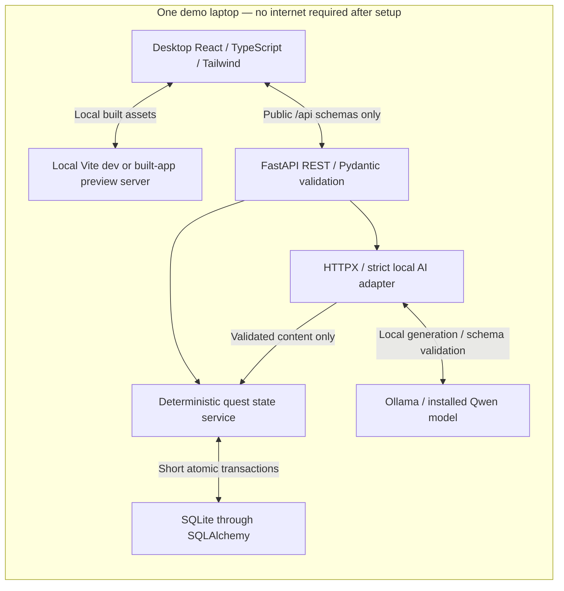

# Sibol architecture

Current implementation snapshot, October 10, 2026. Source:
[final PRD v2.0](Local_AI_Quest_Companion_Final_PRD.docx),
[DECISIONS](DECISIONS.md), [API_CONTRACT](API_CONTRACT.md) and
[DATABASE_DESIGN](DATABASE_DESIGN.md). Sibol was previously named Local AI Quest
Companion. Historical phase/benchmark records describe their own checkpoints.

React implements check-in, generation, a selected saved campaign, explicit
completion, pause/resume, frontend replanning and a completed-stage Journey
timeline. FastAPI owns deterministic progression and persistent check-ins/AI
intents. SQLite schema v4 has eight application tables and explicit migrations.
The legacy PWA is retired; generic AI diagnostics remain a utility.

Production plan acceptance uses strict schemas and deterministic essential checks,
with at most one correction and no model self-review call. Content usefulness is
still model-dependent. Hint/shrink are unimplemented; advanced Progress is a
foundation. [Demo readiness](DEMO_READINESS.md) distinguishes user-reported
Windows/offline/QA results from automation and remaining live replan QA.

## System overview

The browser never calls Ollama or SQLite directly. A model generates language and
planning content; deterministic Python owns completion, XP, unlocking, dates and
validation. No remote inference, cloud DB, mandatory authentication, service
worker, mobile packaging or game-world engine belongs to P0.

## Repository audit and reusable infrastructure

| Existing file/area | Reuse | Gap or risk |
| --- | --- | --- |
| [frontend/package.json](../frontend/package.json) | React/TypeScript/Vite/Tailwind/Router; strict type/build scripts and lockfile | Exact locked versions are authoritative. Native Node boundary tests and a Chromium/Opera harness live in `frontend/tests`; no extra test dependency or lint script. |
| [frontend/src](../frontend/src/) | Typed pages/components/hooks/API client; cancellation, loading and recovery | Backend state is authoritative. Check-in/questline URL identifiers restore saved records; checklist marks are temporary. |
| [vite.config.ts](../frontend/vite.config.ts) | Local asset build; localhost:5173 dev and localhost:4173 preview, strict ports | No generated manifest/worker. Browsers with a previous PWA installation require scoped cleanup. |
| [main.py](../backend/app/main.py), [routes.py](../backend/app/routes.py), [quest_routes.py](../backend/app/quest_routes.py) | Lifecycle/bootstrap, explicit CORS, diagnostics and product routes | Database health and AI status are separate. Product writes use typed errors and revision/idempotency guards. |
| [config.py](../backend/app/config.py) | Pydantic Settings and dotenv examples | Ollama's adapter rejects non-loopback URLs before network access. Relative DB paths depend on the backend working directory. |
| [database.py](../backend/app/database.py), [models.py](../backend/app/models.py), [schema.py](../backend/app/schema.py), [quests.py](../backend/app/services/quests.py) | Eight tables, FK/WAL/explicit transactions, verified bootstrap/migrations and deterministic progression | Unknown/inconsistent databases remain preserved and unavailable; never reset them to bypass an error. |
| [check_in.py](../backend/app/services/check_in.py), [ollama.py](../backend/app/ollama.py), [schemas.py](../backend/app/schemas.py) | Persistent clarification, generation/replan intents, bounded inference and strict validation | No inference under a write lock. Essential checks do not guarantee useful content. |
| [backend tests](../backend/tests/) and [frontend tests](../frontend/tests/) | State/persistence/contracts, frontend boundaries and browser regressions | Mocked Ollama and temporary SQLite are not evidence of real model quality or disconnected-internet operation. |
| [AI disclosure](AI_DISCLOSURE.md) and [demo readiness](DEMO_READINESS.md) | Current model choice, evidence boundaries and submission gaps | Exact artifact/license and official event verification remain pending. |

Diagnostic routes are `GET /api/health` (database readiness), `GET /api/ai/status`
(tags/model availability), `POST /api/ai/generate` (`{prompt}` → `{model,response}`).
Generic diagnostic errors use `detail`; state routes use a typed `error`
envelope. `/docs`, `/redoc`, `/openapi.json` are framework utilities. Optional
interactive docs reference external UI assets; core application use must not rely
on them.

Health now checks DB availability without contacting Ollama. State routes add saved list/detail/profile,
complete and pause/resume. These use explicit filtered DTOs, sanitized error
envelopes and no-store responses. Generic AI routes retain their contracts.
Internal create/replace operations never call AI; no hidden-plan/fixture endpoint.
Services open their own short synchronous units in FastAPI worker threads.

## Responsibilities and file boundaries

Reuse current directories. Phase 2 added `backend/app/models.py`,
`backend/app/services/quests.py`, `quest_routes.py` and bootstrap in `schema.py`.
`services/check_in.py` implements persistent orchestration. Keep schemas in `schemas.py`,
inference in `ollama.py` and diagnostics in `routes.py`. No repository layer, event bus,
background queue, Docker or separate AI server abstraction is needed.

- HTTP: strict inputs, recoverable errors, public projections and request IDs.
- Quest service: revisions, transactions, profile/XP, pause/resume and gating.
- AI adapter: strict generation/replacement proposals, prompts, bounded correction
  and deadlines; hint/shrink operation designs remain proposed.
- SQLite now: profile, questlines, versions, quests, completion ledger and compact
  pause/resume receipts, check-ins and durable AI generation/replan intents.
  See [DATABASE_DESIGN](DATABASE_DESIGN.md).
- React: check-in, one selected line/current quest, saved summaries/history,
  explicit actions and recovery. See [FRONTEND_PLAN](FRONTEND_PLAN.md).

## Data flow and transactions

1. Check-in validates user capacity/deadline, interprets locally, then saves ready
   context or one essential follow-up. No repeated interview loop.
2. Generation loads a ready check-in, reserves an idempotency receipt, calls AI
   outside a write transaction, validates 2–6 whole-goal stages, assigns trusted fields, and
   atomically creates line/version/quests, consumes the check-in and succeeds the
   receipt. Only current quest and aggregate counts are returned.
3. Completion serializes a short SQLite write: check unique completion first,
   then state/revision; award XP once, complete and unlock next (or finish line),
   all before commit.
4. Replanning captures revision, calls AI outside the transaction, then
   reacquires a write and rejects stale results. Replan validates replacement content
   before superseding unfinished quests. Completed IDs/XP stay unchanged; AI/DB
   failure leaves business state unchanged (operational receipts may record failure).
   Completed plus replacement stages are capped at six; one remaining stage is
   allowed after completed history. Hint/shrink have no implemented operation yet.
5. Reload/restart retrieves profile/list/detail. React is a view, never authority;
   a lost-response retry may not duplicate rewards or plans.

Use one Uvicorn worker for the demo, but enforce invariants in DB/services so
multiple requests/tabs cannot bypass them. Never hold a write lock during Ollama.

## Configuration and offline operation

Keep `VITE_API_BASE_URL`, `OLLAMA_BASE_URL`, `OLLAMA_MODEL`, `DATABASE_URL`,
`CORS_ORIGINS`. Public examples are in [frontend/.env.example](../frontend/.env.example)
and [backend/.env.example](../backend/.env.example); never publish actual private
values. Intended UI: `http://localhost:5173`; backend/Ollama:
`http://127.0.0.1:8000` / `http://127.0.0.1:11434`. Preview uses local port 4173.
Retain 127.0.0.1 CORS origins while supporting localhost. CORS allows GET/POST and
Content-Type/Idempotency-Key, exposes Retry-After, and does not allow credentials
or wildcard origins. Frontend retries retain the original key/body for the same
intent; stale responses reload canonical state.

User-selected demo primary `qwen3:4b`; manually select installed fallback
`qwen3:1.7b` and restart. The Python settings default remains 1.7B, while the source
environment example shows the chosen 4B primary.
No automatic failover/pull. Settings load backend dotenv by absolute location;
process environment overrides it. Restart after changes. Vite variables are
public/build-time: restart or rebuild. Run backend from `backend/` for consistent
`sqlite:///./app.db`, or configure an explicit location. New timeout settings,
if introduced during implementation, must update examples; see [AI_DESIGN](AI_DESIGN.md).

Desktop offline operation requires the frontend server, FastAPI, Ollama, model
weights and SQLite file on the same laptop. Disconnect internet, not loopback.
The browser fetches local assets from the running server; no PWA cache is needed.
If that server stops, reload may fail—an expected service boundary. Initial tools,
packages and models need downloads or local copies; core features then run locally.

## Phase 1A PWA retirement

Removed VitePWA/Workbox configuration and dependency (npm lockfile updated),
useRegisterSW and cached/update UI, virtual PWA TypeScript types and the mobile
apple-touch-icon reference. Main React entry point, Router, API client, cancellation,
loading/error states and distinct browser/backend/AI indicators are preserved.
The favicon and local PNG icons remain; unused PNGs have no installation or caching
behavior. A fresh production build emits no manifest, worker or Workbox code.

Removing build code does not remove a worker already installed in someone's browser.
Follow [origin-scoped cleanup](OFFLINE_TESTING.md#old-service-worker-cleanup-phase-1a)
on each previously used hostname/port; verify the app worker/controller/cache are
absent. The app does not unregister unrelated workers or delete caches at startup.
Fresh-profile Linux browser verification is separate from cleaning existing
developer profiles and the actual Windows demo browser.

At the historical Phase 1A checkpoint, backend health was liveness-oriented and
the three scaffold endpoints were unchanged. Subsequent phases added the current
database readiness, product endpoints, strict generation and persistence described
above; that old checkpoint is not the current feature inventory.

## Failures and privacy

- AI unavailable: reads/completion/pause/resume still work if SQLite is healthy;
  AI operations report recovery, never silently use cloud inference.
- Invalid/stale plan: reject before business mutation; original line/history/XP
  unchanged. SQLite errors roll back; no success UI before commit.
- Lost responses: reload canonical state, retry with the same idempotency key.
- No raw goals/notes/prompts/output logs or analytics. DB stores sensitive context
  locally in plaintext; local-only does not imply encryption or protection from
  other laptop users. Use synthetic evidence; never commit DB/backups.
- Explicit DTOs hide locked/superseded content and internal receipts/model metadata.
  No diagnosis, therapy, treatment or AI authority over progression.

## Scope and proof

P0 includes the core/adaptive loop, saved lines, plain completed history/progress.
The full P1 Quest Journey, P2 rewards and deferred features are excluded. The
user-approved Journey timeline is read-only completed history. Acceptance maps
FR-01–FR-09 in the roadmap; hint/shrink leave FR-04 incomplete. Consult demo
readiness for current Windows/offline reports, mocked regression results and
remaining live replan, performance, license and submission evidence.
