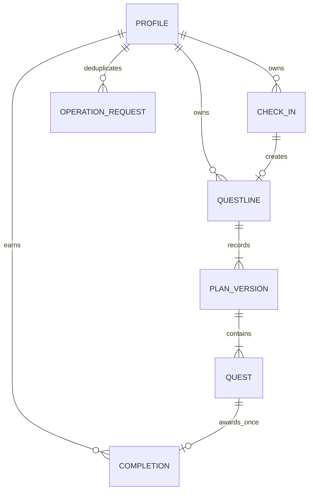

# SQLite and SQLAlchemy design

## Completion encouragement — current schema version 4

`quests.completion_encouragement` is nullable text for optional model copy; no new
tables, rewards or state transitions. Proposal validation bounds and sanitizes
copy independently of essential quest fields. Public DTOs return null before
completion and a quest-specific message in completed history only. First
completion saves grounded final copy atomically with existing ledger/XP/unlock
writes; duplicate requests do not rewrite it or award XP. Existing completed rows
with null copy use deterministic read-only fallback.

Startup checks the exact v3 catalog then executes `ALTER TABLE quests ADD COLUMN
completion_encouragement VARCHAR` and sets `user_version=4` in the guarded
transaction. No data copy/drop/reset is needed for this upgrade; FKs stay enabled
for v3→v4. Fresh databases initialize directly at v4; v1/v2 upgrades chain through
v3 and v4 atomically. Full current ORM integrity verification runs after all mapped
columns exist, before commit. Catalog/FK/state/XP checks still reject corruption;
any failure rolls back the entire chain. Preserve a proper SQLite backup before
upgrading important data. [test_encouragement.py](../backend/tests/test_encouragement.py)
covers v3 row preservation, legacy fallback, rollback and schema mismatch refusal;
the existing v1/v2 migration suites also run against the current schema.

## Adaptive sizing — schema version 3 checkpoint

Approved post-PRD initial campaigns are 2–6 stages; replacement proposals are 1–6,
with the service additionally enforcing completed + remaining <=6 for new replans.
The same service enforces total >=2: a single replacement requires completed history.
No new entities/columns. PlanVersion's count CHECK is widened to <=6 and its
initial minimum lowered to 2. Existing rows, IDs, state, XP, timestamps, check-ins,
receipts and intents remain unchanged. Legacy longer histories remain valid.

Startup explicitly migrates exact schema v2→v3 by creating a replacement
plan_versions table, copying every column, dropping the old table and renaming
the replacement inside one BEGIN IMMEDIATE transaction. It follows SQLite's
[generalized ALTER procedure](https://www.sqlite.org/lang_altertable.html#otheralter):
FK enforcement is disabled only on the dedicated migration connection before
BEGIN, then exact catalog/FK/state checks precede commit. Enforcement is restored
and verified before pooling the connection; failed restoration invalidates it.
No writable_schema or database reset. A failure after DROP rolls back DDL, rows
and user_version. Version-one startup chains both upgrades atomically. Normal v3
startup retains FK enforcement and performs no table rebuild.

Before using the updated backend with important data, stop the old backend and
back up the configured SQLite database using SQLite's backup API. Startup handles
the reviewed upgrade automatically; no manual edits to saved data are required.
[test_adaptive_sizing.py](../backend/tests/test_adaptive_sizing.py) tests old 3–5
campaigns, paused state, XP/history/receipts, rollback after DROP, FK restoration,
unknown schema refusal and legacy larger-history completion.

## Phase 3 implementation — schema version 2

The six Phase 2 tables/constraints are unchanged. Two additive tables implement
the current workflow in [models.py](../backend/app/models.py):

- `check_ins`: UUID PK, profile FK, original bounded context, needs_follow_up/
  ready/consumed status, revision, summary, original question/accepted answer,
  follow_up_count 0/1 and timestamps. Unique nullable questline_id FK resides here,
  rather than rebuilding questlines to add the inverse FK. CHECKs require matching
  follow-up fields; consumed requires a line and ready requires an accepted summary.
  Existing Phase 2 lines remain valid without a check-in link.
- `generation_intents`: UUID key PK, profile FK, operation, typed-by-service target
  ID, canonical request hash, pending/succeeded/failed state, attempt_number,
  lease_expires_at, result resource ID, safe error code and timestamps. The partial
  unique `(operation,target_id)` pending index serializes intents for one target.
  CHECKs require a lease for pending and a result ID for success; no transcript or
  raw plan is stored here. Resource IDs are validated by operation at startup.

Check-in start/answer commits its successful receipt with context in one short
transaction. AI intent reservation commits before inference. Generation/replan
has a 120-second precommit budget, each attempt <=60, one shared format/essential
correction; Phase 3D removed mandatory review. Lease=135. Commit rechecks intent state,
attempt, unexpired lease and target revision/state. Existing quest services accept
a private caller-owned Session to join the atomic plan + check-in consumption +
successful receipt transaction. No second competing quest engine exists.

If inference/validation/semantic checking/storage fails, business state rolls
back and the owning intent is marked failed when storage permits. If the process
dies or failure cannot be recorded, lease expiry permits explicit recovery.
Attempt fencing prevents the previous worker from saving or overwriting a newer
attempt. Old pause/resume receipts and AI intents reject cross-table key reuse.

[schema.py](../backend/app/schema.py) contains explicit `migrate_v1_to_v2`.
Startup validates the exact v1 catalog and state, adds only these two tables,
sets user_version=2 and verifies catalog/FKs/state inside the same transaction.
The migration changes no old rows, XP, completion history, quests, versions or
constraints. Failed DDL rolls back with version 1 intact. Unknown/mismatched
schemas are refused, never recreated. New empty databases initialize directly
at v2. Back up important data with services stopped before upgrading.

[test_check_in.py](../backend/tests/test_check_in.py) tests v1 fixtures containing
earned XP/completed history, unchanged rows after migration, repeated bootstrap,
failed migration rollback, new-process retrieval, expired leases and old-worker
fencing. These are temporary-file Linux tests, not a Windows demo claim.

## Phase 2 implementation record — schema version 1

Implemented in [models.py](../backend/app/models.py),
[schema.py](../backend/app/schema.py), [database.py](../backend/app/database.py)
and [services/quests.py](../backend/app/services/quests.py). The original seven-entity
blueprint below remains the future check-in/AI orchestration baseline; it is not
the current schema inventory.

Current tables: `profiles`, `questlines`, `plan_versions`, `quests`, `completions`,
`transition_receipts`. Accepted goal/summary/time/energy/deadline/notes live on
questlines and immutable plan versions. CheckIn and its unique consumed-context
link are deferred to Phase 3; no incomplete check-in state machine is installed.
The creation service accepts validated context/plan, not a check-in ID, and does
not deduplicate creation intents yet. There is no public creation route.

The core PK/FK/CHECK/index design below is implemented: singleton profile;
deferred same-line current pointer/current plan FKs; unique per-version order;
partial unique active/paused index; bounded integers/content; difficulty-to-XP
checks and terminal timestamp checks. Completion has a unique quest PK and a
composite `(quest_id,xp_awarded)` FK to `(quests.id,quests.xp_reward)`, additionally
rejecting a mismatched reward. ORM relationships are read-only navigation;
services explicitly sequence flushes around circular FKs and current-slot changes.

`transition_receipts` is the smallest durable mechanism needed for exposed
pause/resume endpoints: key UUIDv4 PK, profile/questline FKs, action pause/resume,
positive expected_revision and created_at. Comparing all three intent fields
detects key conflicts. Receipt and state commit together; a replay returns the
latest public view without reapplying an old pause/resume. General pending AI
receipts, leases and fencing below remain future work; completion uses its ledger.

All service writes use BEGIN IMMEDIATE before reading; reads use explicit BEGIN
snapshots. Every connection enables FKs, five-second busy timeout and synchronous
FULL; bootstrap sets file WAL outside transactions. Memory databases use SQLite's
memory journal. Supported production persistence is file-backed SQLite.

Bootstrap creates tables/profile and sets user_version=1 only for an empty
version-0 database. Valid restarts compare the complete table/index SQL catalog
against the version-one schema, check foreign keys and verify line/current/ledger/
XP invariants. Unsupported, partial or inconsistent storage is never repaired,
reset or silently migrated; HTTP diagnostics remain available and product routes
return STORAGE_UNAVAILABLE. An invalid URL or unreadable parent may still prevent
startup. Future CheckIn/AI-receipt additions need a reviewed versioned migration;
create_all cannot change a saved schema. Back up before that change.

Tests in [test_quests.py](../backend/tests/test_quests.py) use temporary files,
separate connections/threads and a new Python process. They cover rollback at each
write stage, deferred-FK commit failure, concurrent completion and durable receipt
replay. This is Linux automated evidence, not Windows/offline demo approval.

## Original full P0 blueprint (remaining orchestration is proposed)

Proposed P0 schema; **no models, tables or migrations are created in Phase 0**.
Follow [QUEST_RULES](QUEST_RULES.md) and [API_CONTRACT](API_CONTRACT.md). Seven
SQLAlchemy entities support the journey; request receipts are a small durability
mechanism, not an asynchronous job system.

Implement with the existing SQLAlchemy declarative Base and SQLAlchemy 2 typed
Mapped/mapped_column patterns. Model names: Profile, CheckIn, Questline,
PlanVersion, Quest, Completion and OperationRequest. Keep these internal ORM
models separate from Pydantic public/AI DTOs; do not add them during Phase 0.

## Relationships

IDs except profile are backend UUIDv4 TEXT. Store all timestamps in one canonical
UTC RFC3339 TEXT form (`Z`, fixed precision); parse user offsets deterministically
in Python, never compare mixed-offset strings or naive local datetimes. Typed
Pydantic DTOs serialize explicitly. Integer counters/XP/positions are nonnegative
or positive as noted. SQLite enums use TEXT plus CHECK, not silent free strings.
All listed columns are NOT NULL unless explicitly optional/nullable. Add
typeof(column)='integer' checks to integer counters, XP, minutes and positions
where SQLite affinity alone would otherwise admit a fractional value.
Private goal/notes/summary/quest content are local plaintext, never public logs.

## Tables and keys

### profiles — local Progress entity

`id INTEGER PK CHECK(id=1)`, `total_xp INTEGER NOT NULL DEFAULT 0 CHECK(total_xp>=0)`,
`created_at`, `updated_at` NOT NULL. Exactly one initial row, XP=0. Level is computed
as total_xp // 100 + 1, not stored independently. Profile→lines/check-ins/completions/
receipts relationships. The completion ledger is the reward source of truth;
total_xp is its transactional aggregate.

### check_ins — context and one follow-up

- `id PK`, `profile_id FK profiles.id NOT NULL`.
- `goal` (1–4000), `available_minutes` (1–1440), `energy` low/medium/high,
  `deadline` nullable UTC, `contextual_notes` nullable (<=2000).
- `status` needs_follow_up/ready/consumed; `revision >=1`.
- `summary` nullable (<=2000), `follow_up_question` nullable (<=300),
  `follow_up_answer` nullable (<=2000), `follow_up_count IN (0,1)`.
- `created_at`, `updated_at` NOT NULL. SQL checks require a question/count=1 for
  needs_follow_up and disallow question/count mismatch; ready/consumed require
  summary. Backend answer state machine forbids another question.

Questline has the unique FK to this table; obtain associated line via that relation,
not a redundant second pointer. Status/revision guard answer/generation races.

### questlines

- `id PK`, `profile_id FK profiles.id NOT NULL`, `check_in_id UNIQUE FK check_ins.id
  NOT NULL` (one line per consumed check-in).
- `goal`, `check_in_summary` NOT NULL; latest `available_minutes`, `energy`,
  `deadline`, `contextual_notes` with the same bounds as CheckInContext.
- `status` active/paused/completed; `plan_version >=1`, `revision >=1`.
- `active_quest_id` nullable; `created_at`, `updated_at`, nullable `completed_at`.
- CHECK active/paused require non-null current pointer and null completed_at;
  completed requires null pointer and non-null completed_at.
- Composite deferred FK `(active_quest_id,id)` → quests `(id,questline_id)` prevents
  a pointer to another line. Composite deferred FK `(id,plan_version)` →
  plan_versions `(questline_id,version)` ensures current version exists.

Pointer means current active **or paused** quest, despite its historical column
name. Status match/current version/exactly-one are checked by the state service.
Initial creation preallocates line/quest UUIDs, inserts line with non-null pointer,
then version and quests before commit. Deferred FKs allow that order; no transient
draft line is committed. Use explicit SQLAlchemy insert/update sequencing instead
of a circular ORM relationship flush that temporarily nulls required pointers.

### plan_versions

Composite PK `(questline_id FK questlines.id, version INTEGER>=1)`. Fields:
`reason` initial/replan, `available_minutes`, `energy`, optional `deadline`,
`contextual_notes`, `change_reason` (<=1000), `check_in_summary`,
`generated_quest_count`, `model_tag`, `prompt_version`, `created_at`.
Current CHECK: initial has version=1 and count 2–6; replan has version>1 and count
1–6. The service caps completed plus remaining at six before any replan mutation.
Immutable context/audit snapshot, not a public API response. No raw model output
or transcript is needed. Full quest content is in related quest rows.

### quests

- `id PK`, `questline_id FK questlines.id NOT NULL`, `plan_version >=1`,
  `position >=1`. Composite FK `(questline_id,plan_version)` → plan_versions.
- `title` (1–100), `action` (1–2000), `completion_criteria` (1–1000),
  `estimated_minutes` (1–1440), `difficulty` easy/medium/hard.
- `xp_reward` with CHECK matching exactly easy=10 / medium=20 / hard=30.
- `status` locked/active/paused/completed/superseded.
- Nullable `hint`, `starting_action` (each <=1000), `created_at`, `updated_at`,
  nullable `completed_at`, `superseded_at`. CHECK timestamps match terminal status.
- UNIQUE `(questline_id,plan_version,position)`; UNIQUE `(id,questline_id)` for
  the composite pointer FK. Partial UNIQUE index on questline_id WHERE status IN
  ('active','paused'): **at most one current quest per line**, across all versions.

Keep locked/superseded rows internal. Completed content/reward/version/order never
changes. Hint/shrink only update assistance on the current active quest. Superseding
sets terminal state/time, never deletes prior records.

### completions

`quest_id PK FK quests.id` (unique by construction), `profile_id FK profiles.id
NOT NULL`, `xp_awarded CHECK IN (10,20,30)`, `completed_at NOT NULL`.
No mutable completion endpoint, no second award for a quest. The service checks
profile belongs to the questline and award equals stored reward; inserts the row
with quest/profile updates in one transaction. Relationships are one-to-zero/one
from quest and many-to-one profile. No additional rewards table is needed.

### operation_requests — durable intent receipts

Composite PK `(profile_id FK profiles.id, key UUID)`. Fields: `method`, `path`,
`request_hash` (SHA256 of canonical validated body + method/path), `state`
pending/succeeded/failed, `attempt_number >=1`, nullable `lease_expires_at`,
`resource_id`, `result_json`, `error_code`, `created_at`, `updated_at`.
CHECK pending requires lease; succeeded/failed have no active lease.
Result JSON is small: saved resource identifier, or accepted assistance text;
not the full hidden plan or raw input. Target IDs are interpreted by trusted
service code, not generic polymorphic ORM serialization.

AI operations reserve pending before inference, outside the later business commit.
Pause/resume create succeeded receipts in their state transaction without a lease.
Completion relies on its unique ledger instead. Succeeded receipt and mutation
commit atomically. A pending duplicate returns REQUEST_IN_PROGRESS, never reruns
AI; lease is 45 seconds for check-in/hint/shrink, 135 for generation/replan (budget
plus 15 seconds). A killed/expired request is recoverable with the same key/body.
Before restarting a lease, verify no succeeded receipt and revalidate target state;
an expired old worker must be fenced by attempt_number/lease ownership so it cannot
later commit. Business transaction checks both captured revision and receipt attempt.
Retryable failed receipts allow an explicit retry; nonretryable input failures
require a new corrected intent. Operational failures may update receipts, never
silently alter a questline. Retain receipts through the demo; no cleanup job in P0.

Every AI commit requires receipt state=pending, matching attempt_number and an
unexpired lease, not just an unchanged questline revision. This also rejects a
late worker before a replacement worker has acquired a new attempt.

## Indexes and database enforcement

Indexes: lines `(profile_id,updated_at,id)` and `(profile_id,status)`;
check_ins `(profile_id,status)`; quests `(questline_id,plan_version,status,position)`;
completions `(profile_id,completed_at)`; receipts `(state,lease_expires_at)`.
PK/UNIQUE keys already index profile, IDs, plan versions and deduplication keys.
Foreign-key deletes are RESTRICT/NO ACTION for P0; no deletes/cascading history
loss endpoint. Configure SQLAlchemy relationship foreign_keys explicitly where
pointer/composite FKs otherwise create ambiguous paths.

SQLite supports partial unique indexes; use SQLAlchemy `Index(..., unique=True,
sqlite_where=...)` during Phase 2 to enforce the current-row rule. This is at-most
one, not an aggregate exactly-one assertion. [SQLite index reference](https://www.sqlite.org/lang_createindex.html)
and [SQLAlchemy SQLite dialect](https://docs.sqlalchemy.org/en/20/dialects/sqlite.html).

Enable `PRAGMA foreign_keys=ON` on **every** connection, outside a transaction.
Deferred pointer/version FKs must be satisfied at commit. Test cyclic initialization
and constraints with foreign keys actually enabled; do not rely on defaults.
[SQLite foreign-key reference](https://www.sqlite.org/foreignkeys.html).

## Connections, snapshots and transactions

Use WAL for the local file, synchronous=FULL and busy_timeout=5000 ms. Configure WAL
at bootstrap and FK/synchronous/busy settings on connections. Keep check_same_thread
false from scaffold, but never share a Session across requests/awaits/threads.
Synchronous DB units run in FastAPI's worker pool; create/close their Session inside
that unit and return plain snapshots. No write session survives an Ollama await.

SQLite allows one writer; BEGIN IMMEDIATE obtains the write reservation before
reading state. Read DTOs use a real read transaction for one snapshot. Implement
one tested transaction helper compatible with Python 3.11+; do not blindly nest
BEGIN within Session autobegin or assume legacy sqlite3 SELECT starts a snapshot.
A viable SQLAlchemy approach disables driver legacy begin via isolation_level=None
and emits BEGIN (reads) / BEGIN IMMEDIATE (writes) from one coordinated begin hook.
Do not combine competing autocommit/begin strategies. [SQLite transaction reference](https://www.sqlite.org/lang_transaction.html).

### Completion unit of work

1. BEGIN IMMEDIATE; load quest and line/profile. Unknown/locked/superseded → public
   404. Existing ledger → return already_completed/0; skip stale revision check.
2. First completion requires current active quest, active line and expected revision.
3. Insert unique completion; mark quest completed/time; add stored reward to profile.
4. Activate smallest locked position in current version only, after old row is no
   longer current; update pointer. If none, set line completed/pointer null/time.
5. Increment revision/timestamps; check line/current/ledger/reward invariants; commit.
   Rollback all business writes on any error. Build response from consistent state.

Two transactions serialize; second sees the ledger. A unique conflict/failed commit
cannot leave credited XP without its completion or activate two next quests.

### Initial plan / replan / assistance

Initial: validate outside transaction; acquire write; verify receipt ownership and
ready check-in revision; insert all versioned entities, pointer and first active;
consume check-in; succeed receipt; validate invariants and commit.

Replan: snapshot completed records/revision/current plan; infer/validate outside
write; BEGIN IMMEDIATE; verify attempt ownership, unchanged revision/active state;
insert new version, mark all old unfinished active/locked rows superseded, then
insert replacements (first active), switch pointer/version/capacity, increment
revision and succeed receipt. Completed rows/ledger/profile are untouched.
Every SQL/storage/stale/format error retains the original business state.

Hint/shrink: same snapshot/attempt/revision guards, but update assistance and
revision only. Pause/resume: short state/receipt transaction; preserve pointer/XP.
No cross-row CHECK can enforce all these invariants: backend postconditions and
file-backed concurrency/rollback tests are required in addition to constraints.

## Persistence, bootstrap and migration policy

Run from backend/ for default app.db or set an explicit DATABASE_URL. Phase 2 adds
versioned bootstrap with `PRAGMA user_version=1`: on a genuinely empty version-0
DB create models and singleton profile; otherwise verify expected schema/version.
SQLAlchemy create_all does not migrate constraints. Refuse unsupported/partial
schema with actionable error; never drop/recreate an unknown user's DB. Future
versioned changes need an explicit reviewed migration/backup, not an implicit reset.
No migration framework is required for the first schema, none installed in Phase 0.

For storage/schema readiness errors keep HTTP readiness available when
configuration allows startup, mark database unavailable, and reject business
routes with STORAGE_UNAVAILABLE. Invalid startup configuration may still prevent
the process starting; the client then reports backend unreachable.

On restart verify schema, pointer/status/version and ledger/profile consistency;
do not silently repair or reset corruption. Saved rows, accepted assistance and
completed rewards must survive new engine/process connections. Expired pending
receipts become recoverable; successful receipts/ledger protect lost-response
retries. Uncommitted work rolls back. Backup only with services stopped or a proper
SQLite backup method; copying a live .db without its WAL is not evidence of durability.

## Phase 2 acceptance tests

Fresh/repeated bootstrap; no phantom initial XP; enabled FKs/partial uniqueness;
first/final/duplicate/concurrent completion; reward boundary/ledger consistency;
pause/resume idempotency; stale revisions and lease fencing; rollback injected at
each completion/replan write; completed history immutable; no superseded unlock;
new-process file persistence; unsupported schema safe failure. Existing in-memory
smoke tests do not establish these properties.
