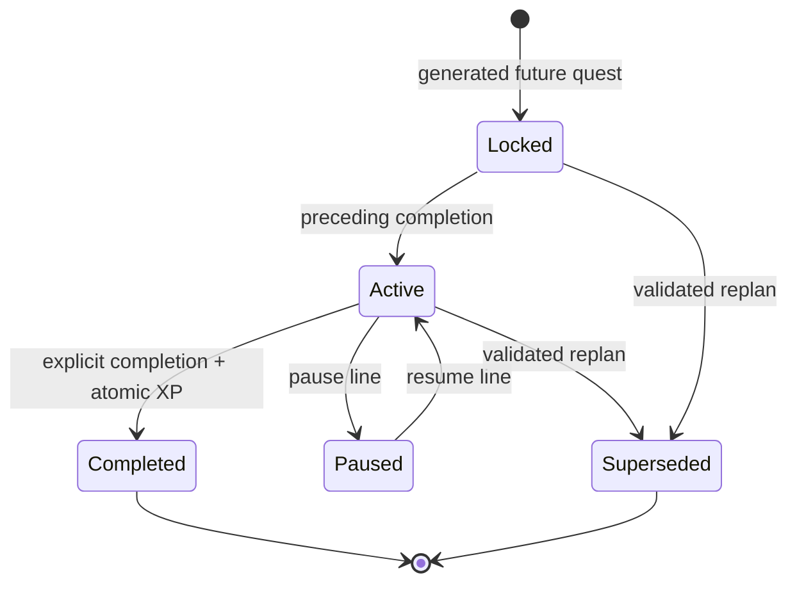

# Quest state and reward rules

Proposed P0 rules from PRD §6–8/§11–12 and locked decisions. Not implemented yet.
[DATABASE_DESIGN](DATABASE_DESIGN.md) assigns DB/service enforcement;
[API_CONTRACT](API_CONTRACT.md) defines public visibility and concurrency inputs.

## State machine

Generation directly creates the first quest active, others locked. Paused lines
must resume before replan, so paused→superseded is not a public P0 transition.
Completed/superseded are terminal. No failed/expired quest state or automatic
completion exists. Line states are active, paused, completed; completed is terminal.
Check-ins are needs_follow_up, ready, consumed; ready→consumed creates exactly one
line. Follow-up answer reaches ready without another question.

| User operation | Preconditions | Atomic result | Reward effect |
| --- | --- | --- | --- |
| Initial generation | Ready unconsumed check-in | Version 1, 3–5 quests, first active, pointer set, line active | None |
| Complete | Current active quest, active line, matching revision | Quest completed + ledger entry + profile update; smallest remaining current-version order becomes active, or line completed/pointer null | Once: 10/20/30 |
| Duplicate completion | Existing completion ledger | No writes/reunlock; return already_completed and latest views | 0 additional |
| Hint/shrink | Current active quest/line, matching revision at commit | Persist validated assistance and increment revision | None; criteria/action/reward/status unchanged |
| Pause | Active line | Current quest paused, line paused, pointer retained, revision increments | None |
| Resume | Paused line | Same quest active, same pointer/plan, line active, revision increments | None |
| Replan | Active unfinished line, matching snapshot revision | New plan version, old unfinished superseded, 1–5 replacements with first active, pointer/capacity/revision updated | Completed ledger/profile unchanged |

Repeated pause/resume when already in the requested state is a no-op; durable
receipt replay returns the latest view and never reapplies an old intent. Expired
deadlines are informational; user may choose supportive replan, never lose XP.

## XP and levels

| Difficulty | Authoritative backend reward |
| --- | --- |
| easy | 10 |
| medium | 20 |
| hard | 30 |

New profile: 0 XP, Level 1. `level = total_xp // 100 + 1`: 90→1, 100→2, 200→3.
Use integer Python arithmetic and DB nonnegative checks. Reward is assigned when
the backend accepts validated difficulty; immutable thereafter. Model XP/status/
IDs/order fields are forbidden. Completion ledger's unique quest_id prevents
repeat credit; profile.total_xp equals the sum of that profile's completion awards.
No streaks, penalties, multipliers, leaderboard, shop or rewards in P0.

## Required invariants

1. Every active line has exactly one active quest, equal to active_quest_id, in the
   current version. Every paused line has one paused current quest and zero active
   quests. A completed line has no current pointer/unfinished current work.
2. Multiple active saved lines are allowed; the UI selects one. Single-current
   uniqueness is per questline, not across the entire profile.
3. Every completed quest has exactly one completion record and vice versa;
   its award matches the backend difficulty mapping and the line's profile.
4. Completion updates quest, ledger, XP, next status/pointer and line revision in
   the same transaction. Double clicks/two tabs cannot both award or unlock twice.
5. Completed IDs, content, versions, timestamps and rewards are never rewritten
   during replan. Superseded rows remain stored but never current/public.
6. Replan creates validated replacement IDs/version/orders in backend code. It
   never edits the old plan before AI success, never holds a DB write lock during
   generation, and rejects if completion/pause/assistance changed the revision.
7. Shrink only supplies a smaller starting action. It does not change the original
   action/criteria, create an XP-bearing child, unlock or claim completion.
8. User time/energy/deadline are typed authority. Optional information is not an
   excuse for repeated questions. No medical treatment/diagnostic workflow.

## Orders, versions and progress

Initial positions are 1..N; first active. Initial plan_version=1. Completion does
not change plan_version, only revision. A replan at K completed quests assigns
positions K+1..K+M to replacement unfinished quests in version V+1. Completed rows
retain their old positions/versions; UNIQUE(line,version,position) prevents clashes.
Only current-version unfinished rows can unlock. Never select the next row from
all versions or reactivate a superseded quest.

`completed_count` counts all completed history, `remaining_count` counts current
active/paused/locked unfinished quests, and total_count is their sum. Superseded
quests are excluded. Replanning may change the denominator; show that honestly.
For a completed line, remaining_count=0 and total_count=completed_count.

## Visibility and authoritative writes

Ordinary GET/detail, list summaries and every mutation result use explicit DTOs.
Detail returns current/paused quest plus completed history; list returns aggregate
metadata only. Never reveal future IDs, titles, actions, criteria, hints, estimates,
rewards or sequence entries. Unknown/locked/superseded IDs produce the same public
404 on quest actions. Internal SQLite/model planning may access full plans locally,
but no debug endpoint, log or frontend DOM may expose them.

All writes are server-authorized state transitions, not arbitrary PATCHes.
Cross-row exactly-one rules require a checked backend unit of work in addition
to DB uniqueness/FKs; a frontend disabled button is only UX. New AI results need
the captured expected revision at commit. Completion checks ledger before stale
revision so a safe replay still succeeds without another reward. Never optimistically
increment client XP or advance a quest before the server's committed response.

## Test obligations

Phase 2 tests: reward boundaries, sequential/final completion, repeat/concurrent
completion, paused restrictions, FK/current uniqueness, ledger/profile equality,
transaction rollback and file-backed restart restoration. Phase 3/4 tests:
schema failure after one retry, AI/storage/stale replan preservation, immutable
completed snapshots, no hidden-data leak across all routes, assistance without XP,
replayed pause/resume/replan and interrupted request recovery. These are required
tests to implement, not claims they exist or passed.
